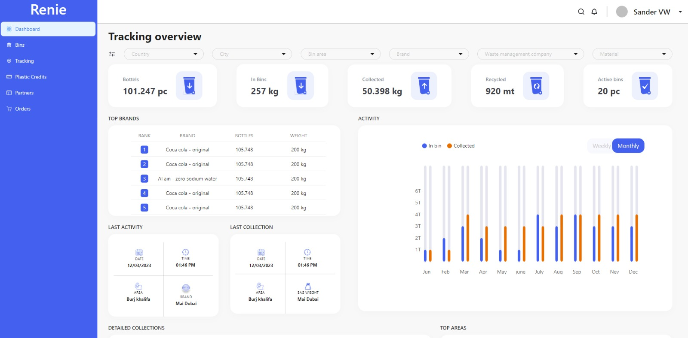
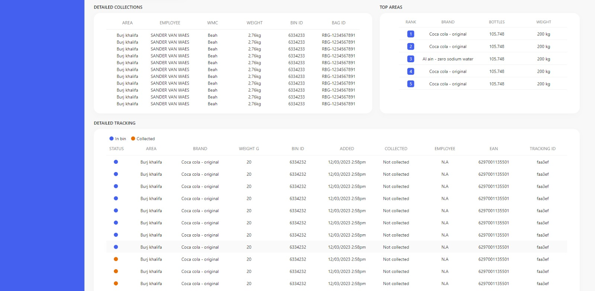

# Renie

I worked on a project during my interview at Renie, an international
company. This project is just a small component of the original, which
is a comprehensive system for managing an entire company's dust
management. The original project includes features such as stakeholder
management, budget management, individual employee management, and
much more

if you are looking for a project where you can learn basics of html,
css, js, React, Recharts, displaying charts in react, hooks and so
much more then this project is best option

##### I worked on this project during my interview at Renie. Please checkout my fiverr account if you want to hire me

- [Find me on fiver ](https://www.fiverr.com/zainbinramzan/develop-web-applications-with-mern-stack-react-node-express-moongodbplugin-react/README.md)
- [Find me on linkedin](https://www.linkedin.com/in/abu-zain-html-css-javascipt-developer/)

## Technologies Used

- **Rechartjs**: Used for displaying the charts on the platform.
- **styled components**: Employed for styling and layout.
- **React**: For entire frontend of website.
